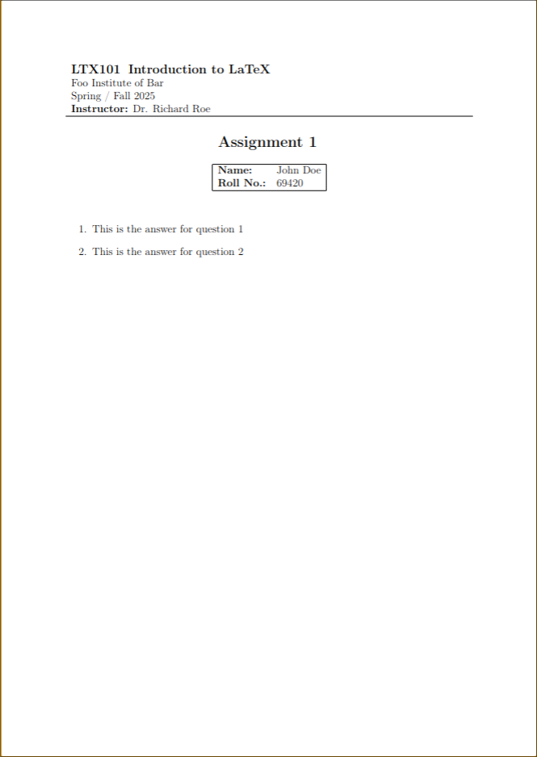

# **AssignMint** 🌿

_Your perfect blend for polished assignments!_

## Overview

**AssignMint** is a clean, modular, and versatile LaTeX template for creating academic assignments that look professional and elegant. Designed for students, researchers, and educators, it ensures your work stands out while keeping formatting hassles at bay.

## Features

- 📄 **Minimalistic and Clean Design**
- 🖋️ **Customizable Header and Footer**
- 🎨 **Support for Graphs, Tables, and Images**
- 🌍 **Multilingual Support**
- 🌳 **Modular Approach**

## Getting Started

### Requirements

- LaTeX distribution (e.g., TeX Live, MiKTeX)
- LaTeX editor (e.g., Overleaf, TeXShop, or VS Code with LaTeX Workshop)

### Usage

1. Clone the repository:
   ```bash
   git clone https://github.com/sattwik-sahu/AssignMint.git
   ```
2. Navigate to the folder:
   ```bash
   cd AssignMint
   ```
3. Open and edit the `vars.tex` file to enter information about yourself and the course details.

4. Compile the document (e.g., using `pdflatex`):
   ```bash
   pdflatex main.tex
   ```
   or press "Recompile" on Overleaf

## File Structure

```
YourAssignment/
├── main.tex        # Main template file [E]
├── title.tex       # Title template
├── vars.tex        # Contains the information about the assignment [E]
├── header.tex      # Contains the header content for each page
├── answers/        # Contains the answer to each question in the assignment
│   ├── q1.tex      # Example: Answer to question 1 [E]
│   ├── ...
├── figures/        # Directory for images and figures in the assignment [E]
├── main.pdf        # Sample output file
└── README.md       # You're here!
```

> `[E]` - You edit these files/folders.

## Preview

Here's a quick look at the polished output:  


## Contributing

Contributions are welcome! Feel free to open issues or submit pull requests to improve the template.

## License

This project is licensed under the GPLv3 License.

---

Enjoy crafting stunning assignments with **AssignMint**! 🍃
